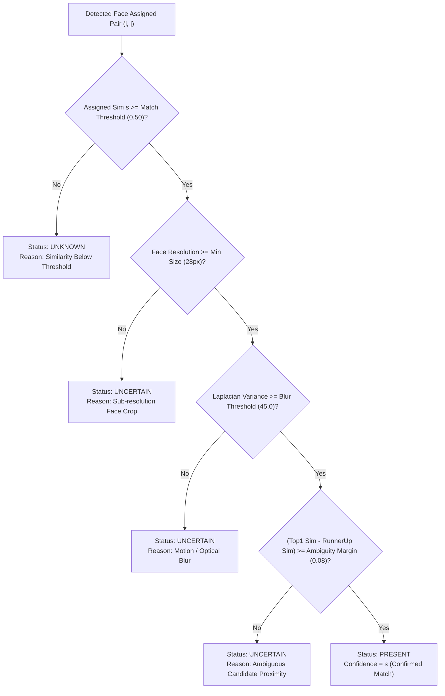

# System Architecture & Technical Specifications

**Face Finder: Smart Classroom Face Recognition & Biometric Attendance System**  
*Local, Privacy-Preserving, Edge-Optimized Biometric Engine*

---

## 1. Architectural Overview

Face Finder is engineered as a zero-cloud, high-precision biometric attendance verification system designed specifically for educational classroom settings. The system operates entirely on-device (Local CPU / DirectML / CUDA), ensuring absolute privacy compliance and institutional data sovereignty.

---

## 2. Core Computer Vision & Biometric Pipeline

### 2.1 Face Detection: SCRFD (Sample and Computation Redistribution)
* **Model:** SCRFD-500M (`det_500m.onnx`, 2.5 MB) / SCRFD-10G (`det_10g.onnx`, 16 MB).
* **Architecture:** Single-stage dense anchor-free feature pyramid network (FPN) optimized via computation redistribution across multi-scale feature hierarchies.
* **Why SCRFD over MTCNN / Haar / YOLO:**
  * **Small Face Sensitivity:** Capable of detecting faces down to $16 \times 16$ pixels in high-density classroom panoramas.
  * **Inference Speed:** Runs in $10\text{--}20\text{ ms}$ on standard modern x86/ARM CPUs.
  * **Integrated 5-Point Landmarks:** Directly outputs sub-pixel coordinates for left eye, right eye, nose tip, left mouth corner, and right mouth corner.

### 2.2 Face Alignment: Umeyama Canonical 112×112 Transformation
Deep facial recognition networks exhibit sharp degradation (15–30% drop in verification accuracy) when facial features undergo in-plane rotation, scale variance, or non-canonical positioning.

Face Finder executes a 2D similarity transformation (Umeyama algorithm via `cv2.estimateAffinePartial2D` and `cv2.warpAffine`) mapping the detected 5 landmarks to standard canonical coordinates:

$$\begin{aligned}
\text{Left Eye} &= [38.2946, 51.6963] \\
\text{Right Eye} &= [73.5318, 51.5014] \\
\text{Nose Tip} &= [56.0252, 71.7366] \\
\text{Left Mouth} &= [41.5493, 92.3655] \\
\text{Right Mouth} &= [70.7299, 92.2041]
\end{aligned}$$

$$\mathbf{x}_{\text{aligned}} = \mathbf{M} \begin{bmatrix} x \\ y \\ 1 \end{bmatrix}, \quad \mathbf{M} = \begin{bmatrix} s \cos\theta & -s \sin\theta & t_x \\ s \sin\theta & s \cos\theta & t_y \end{bmatrix}$$

This produces an aligned $112 \times 112 \times 3$ canonical facial representation invariant to head tilt (roll), scale, and spatial translation.

### 2.3 Feature Representation: ArcFace (Additive Angular Margin Loss)
* **Model:** MobileFaceNet (`w600k_mbf.onnx`, 13.6 MB) / ResNet-50 (`w600k_r50.onnx`, 166 MB) trained on Glint360k/WebFace600k.
* **Embedding Dimension:** $d = 512$, $L_2$-normalized on the unit hypersphere $S^{511}$:

$$\|\mathbf{e}\|_2 = \sqrt{\sum_{i=1}^{512} e_i^2} = 1.0$$

* **Loss Function Rationale:**
Unlike traditional Euclidean Triplet Loss (FaceNet) or CosFace, ArcFace enforces an exact geodesic additive angular margin $m$ directly on the hypersphere:

$$L_{\text{ArcFace}} = -\frac{1}{N} \sum_{i=1}^N \log \frac{e^{s \cos(\theta_{y_i} + m)}}{e^{s \cos(\theta_{y_i} + m)} + \sum_{j \neq y_i} e^{s \cos\theta_j}}$$

where $s = 64$ is the feature sphere scale and $m = 0.5$ is the angular margin. This simultaneously minimizes intra-class angular variance while maximizing inter-class separation.

---

## 3. Classroom Identification & Assignment Formulation

### 3.1 The Classroom Multi-Face Challenge
In a classroom of $N$ enrolled students and $M$ detected faces in an image:
1. **Open-Set Nature:** The image may contain non-enrolled individuals (visitors, observers, teaching assistants).
2. **Ambiguity & Duplicate Vulnerability:** Naive nearest-neighbor matching ($k$-NN or greedy $\arg\max$) allows multiple detected faces to falsely claim the same student identity, or one face to match multiple students.

### 3.2 Global Optimal Bipartite Matching (Hungarian Algorithm)
To eliminate duplicate assignments and resolve ambiguous cluster overlaps, Face Finder formulates identity assignment as a Maximum-Weight Bipartite Matching problem solved via the **Hungarian Algorithm** (`scipy.optimize.linear_sum_assignment`).

1. Construct the Similarity Matrix $S \in \mathbb{R}^{M \times N}$:
   $$S_{i, j} = 0.6 \cdot \max_k \left( \mathbf{e}_i^{\text{det}} \cdot \mathbf{e}_{j, k}^{\text{gal}} \right) + 0.4 \cdot \left( \mathbf{e}_i^{\text{det}} \cdot \bar{\mathbf{e}}_j^{\text{gal}} \right)$$
   where $\mathbf{e}_{j, k}^{\text{gal}}$ represents exemplar reference images for student $j$, and $\bar{\mathbf{e}}_j^{\text{gal}}$ represents the normalized centroid vector.

2. Define the Assignment Cost Matrix $C \in \mathbb{R}^{M \times N}$:
   $$C_{i, j} = 1.0 - S_{i, j}$$

3. Find the optimal one-to-one assignment bijection $\pi: \{1, \dots, M\} \to \{1, \dots, N\}$:
   $$\min_\pi \sum_{i=1}^{\min(M, N)} C_{i, \pi(i)} \equiv \max_\pi \sum_{i=1}^{\min(M, N)} S_{i, \pi(i)}$$

### 3.3 Dual-Threshold Decision Engine
Once the Hungarian bijection $\pi$ assigns detected face $i$ to candidate student $j = \pi(i)$ with similarity $s = S_{i, j}$:

---

## 4. Face Quality & Pre-Filtering

### 4.1 Blur Quantification (Variance of Laplacian)
To prevent degraded low-confidence false positives caused by head motion during photography:

$$\text{Blur Score} = \text{Var}\left( \nabla^2 I_{\text{gray}} \right) = \frac{1}{|K|} \sum_{(x,y) \in K} \left( \nabla^2 I(x, y) - \mu_{\nabla^2} \right)^2$$

Where $\nabla^2$ is the discrete Laplacian convolution kernel $\begin{bmatrix} 0 & 1 & 0 \\ 1 & -4 & 1 \\ 0 & 1 & 0 \end{bmatrix}$. If $\text{Blur Score} < 45.0$, the face is routed to `Uncertain` rather than guessed.

### 4.2 Resolution Guard
Faces with bounding box $\min(\text{width}, \text{height}) < 28\text{ px}$ lack high-frequency facial cues and are flagged as `Uncertain`.

---

## 5. Privacy, Ethics & Biometric Data Governance

1. **Local-Only Architecture:** Zero outbound network traffic for biometric inference. ONNX Runtime executes within local memory.
2. **Explicit Informed Consent:** Students must have `has_consent = 1` recorded in database before biometric template creation.
3. **Cryptographic & Physical Hard Deletion:** Invoking `DELETE /api/students/{id}` immediately executes physical unlinking of image files on disk (`STUDENTS_DIR`) and cascades `DELETE` on all 512-D binary vector blobs in SQLite.
4. **Non-Reversible Representation:** High-dimensional embedding spaces cannot be directly inverted back to photographic likeness without generative priors.

---

## 6. Software Stack & Interfaces

| Component | Technology | Rationale |
| :--- | :--- | :--- |
| **Backend Framework** | FastAPI (ASGI / Uvicorn) | High-performance asynchronous execution, native OpenAPI documentation |
| **Inference Runtime** | ONNX Runtime (CPU / DirectML / CUDA) | Hardware-agnostic cross-platform execution with zero heavy frameworks |
| **Computer Vision** | OpenCV (`cv2`) & Scikit-Image | Image transformations, Laplacian variance, color spaces |
| **Optimization Solver** | SciPy (`linear_sum_assignment`) | $O(N^3)$ Hungarian algorithm for optimal bipartite matching |
| **Persistence** | SQLite 3 | Zero-configuration, ACID compliant local embedded vector database |
| **Frontend** | HTML5, Tailwind CSS, Alpine.js, Lucide | Instant reactive UI, Canvas overlay, Webcam WebRTC, zero-build bundling |
